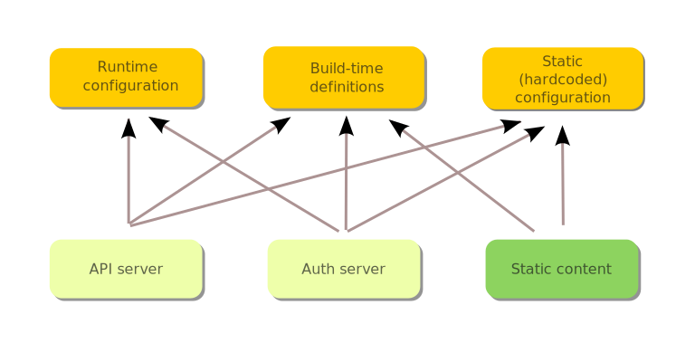

#   KNUR Web Platform Starter 

## Overview
KNUR Web Platform Starter is a starter project for web platform development.
The main goal of this project is to provide a basic structure for web platform development with all necessary tools and configurations.
The main advantage of this project is that it gives you a possibility to develop a web platform with a single server that serves all components and static content.
This will not only simplify the development process but also make it easier to manage the project.
One server for all components and static content is only when development mode is used. 
In production and test mode project is split into several servers in docker compose.
This project is written in TypeScript and uses Webpack for bundling and building.


**Project is still in development and most of the features are not implemented yet.**


## Features
- One server for all components and static content
- Written in TypeScript from scratch
- Whole project is linted with ESLint and Prettier
- Project management scripts (creating snippets, components, pages, etc.)
- JEST for testing in TypeScript
- Webpack for bundling and building
- GitHub Workflow actions for CI/CD
- SSL and HTTP/2 support with redirect from HTTP to HTTPS
- KOA server for backend HTTP requests
- Playwright for end-to-end tests
- Docker compose for running project in production and test mode

## Getting Started
1. Clone the repository
2. Install dependencies
```bash
npm install
```

## Building the project

To build project locally run:
```bash
npm run build:dev # build development version
npm run build:test # build test version
npm run build:production # build production version
```
It should create a `dist\development` (or version specified in the command) folder with all components and with every subdirectory should be `main.cjs` file that is ready to be served.

To remove all build files in `dist` directory run:
```bash
npm run clean
```

## Running the project

To run whole project locally it is possible only in development mode. To run the project in development mode run:
```bash
npm run start:dev # run development version
```

## Running unit and integration tests

Unit and integration tests are written in TypeScript and run with JEST.
The difference between unit and integration tests is that unit tests are testing only one unit of code and integration tests are testing how different units of code work together.
To create a test create a file with `.spec.ts` extension in the same directory inside `__tests__` directory.
When creating unit test then describe should start with `integration: ` prefix.
When creating integration test then describe should start with `unit: ` prefix.

Units tests are split into two categories: backend and frontend. 
To run tests type:
```bash
npm run test:backend:unit # unit tests for backend
npm run test:frontend:unit # unit tests for frontend
npm run test:backend:integration # integration tests for backend
npm run test:frontend:integration # integration tests for frontend
```

## Linting the project

To lint the project run:
```bash
npm run lint
```

Or to fix linting issues and format code please run:
```bash
npm run lint:fix
```

## Project structure
```bash
.
├── .github
│   ├── FUNDING.yml
│   └── workflows
│       ├── e2e-dev-tests.yml
│       └── unit-tests.yml
├── config
│   ├── docker
│   │   ├── build.sh
│   │   ├── run.sh
│   │   ├── server-config.prod.yaml
│   │   └── server-config.test.yaml
│   ├── jest
│   │   └── backend.config.ts
│   └── webpack
│       ├── backend-aliases.json
│       ├── backend.ts
│       ├── build-types.ts
│       ├── frontend-aliases.json
│       └── webpack.config.ts
├── dist
│   ├── package.json
│   └── server-config.yaml
├── e2e
│   └── healthcheck.spec.ts
├── eslint.config.js
├── misc
│   ├── configuration-dev.svg
│   ├── configuration.svg
│   ├── logo-dev.svg
│   ├── logo-hi.png
│   ├── logo.png
│   └── logo.svg
├── scripts
│   ├── generate-alias.mjs
│   ├── generate-certs.mjs
│   └── remove-alias.mjs
├── src
│   ├── backend
│   │   ├── application.ts
│   │   ├── build-info.ts
│   │   ├── config
│   │   │   ├── index.ts
│   │   │   ├── runtime
│   │   │   │   ├── certificates.ts
│   │   │   │   ├── formats.ts
│   │   │   │   ├── index.ts
│   │   │   │   └── schemas
│   │   │   │       ├── common.ts
│   │   │   │       └── server-api.ts
│   │   │   └── __tests__
│   │   │       └── index.spec.ts
│   │   ├── index.ts
│   │   ├── logger
│   │   │   ├── index.ts
│   │   │   └── setup.ts
│   │   └── __tests__
│   │       └── healthchecks.spec.ts
│   ├── common
│   │   └── build-defined.ts
│   └── types
│       └── find-file-up.d.ts
├── .babelrc
├── .gitignore
├── .prettierrc
├── README.md
├── Dockerfile
├── package.json
├── package-lock.json
├── playwright.config.ts
├── docker-compose.test.yml
└── tsconfig.json
```
## Aliases management
Aliases are managed by scripts in `scripts` directory with interactive mode. To add an alias to the project run:
```bash
node scripts/generate-alias.mjs
```
To remove an alias from the project run:
```bash
node scripts/remove-alias.mjs
```
Scripts are responsible to add or remove aliases in several configuration files:
- `tsconfig.json`
- `config/webpack/backend-aliases.json`
- `config/webpack/frontend-aliases.json`
- `config/jest/backend.config.ts`

It is possible to add/remove it manually but remember to update all configuration files.

## Importing modules

Beacuse of TypeScript used in both project and webpack configuration, it is necessary to use aliases for importing modules. To import a module use `@` alias. For example:
```typescript
import { definedGlobals } from '@backend/defined-globals'; // ✅ This will work
```
Remeber that building the project using same tsconfig as used in webpack causes that this is not possible
    ```typescript
    import { definedGlobals } from '@backend/defined-globals.ts'; // ❌ This will not work
    import { definedGlobals } from '../../defined-globals'; // ❌ This will not work
    import { definedGlobals } from '/src/backend/defined-globals'; // ❌ This will not work
    ```
## CI/CD
Project uses GitHub Actions for CI/CD. There are two workflows:
- `unit-tests.yml` - runs unit tests for backend and frontend
- `e2e-dev-tests.yml` - runs end-to-end tests writtne in Playwright for development version of the project

## Backend/frontend configuration implementation

System components must be flexible during runtime operation and aware of the environment for which they were built and in which they are running.
Therefore, information about how a component should work and in what environment it is running is provided from many different sources.



The configuration system is responsible for providing the necessary information to the components. The configuration system is divided into two several parts:
- static configuration (common, frontend, backend)
- runtime configuration
- build-time configuration

### Static configuration
Static configuration is a configuration that is hardcoded in the project and is not changed during runtime.
Currently, there are three types of static configuration:
- common configuration - configuration that is common for both frontend and backend
- frontend configuration - configuration that is specific for frontend
- backend configuration - configuration that is specific for backend (`src/backend/config`)

Common static configuration contains information such as API Endpoint routes for several domains, frontend routes, etc.
Backend static configuration contains information such as logger detailed configuration, etc.

### Runtime configuration
Runtime configuration is a configuration that is provided during runtime and can be changed during runtime.
This configuration is avaliable only in backend components and is read from `dist/server-config.yaml` file.
Configuration is build based on convict library and is validated based on schemas provided in `src/backend/config/runtime/schemas` directory.
Configuration file name `server-config.yaml` is hardcoded in static configuration and is not changed during runtime.
Configuration file is looked up in the root directory of the project and when it is not found, default configuration is used.

**Currently available runtime configuration settings:**
- `logger.level` - Logging level (possible values: fatal, error, warn, info, debug, trace, silent)
- `http.port` - HTTP port that server listens on (default: 3000)
- `http.version` - HTTP protocol version (possible values: `"1.1"`, `"2"`)
- `http.ssl.key` - Path to SSL key file (PEM format) when defined then HTTPS is enabled
- `http.ssl.cert` - Path to SSL certificate file (PEM format) when defined then HTTPS is enabled
- `domain` - Domain name that server listens on

### Build-time configuration
Build-time configuration is a configuration that is provided during build time and is hardcoded in the project.
This configuration is set up by webpack define plugin and is avaliable in both frontend and backend components.
To change build-time configuration it is necessary to change webpack configuration in `config/webpack/backend.ts` and `config/webpack/frontend.ts`.
TypeScript declaration can be found in `src/backend/defined-globals.ts` and should be updated when new configuration is added.

**Currently available build-time configuration settings:**

- `__DEVELOPMENT__` - true if project is built in development mode
- `__PRODUCTION__` - true if project is built in production mode
- `__TEST__` - true if project is built in test mode
- `__COMPONENT_SERVER__` - true if there is only one server for all components and static content
- `__COMPONENT_AUTH_SERVER__` - true if there is a separate server for authentication component

## Certificates
To run it is necessary to provide SSL certificates. Paths to certificates should be provided in `dist/server-config.yaml` file.
If certificates are not provided, the server will not start.
It is possible to generate self-signed certificates using OpenSSL. To generate self-signed certificates run:
```bash
node scripts/generate-certs.mjs
```
It will generate `private.key` and `certificate.crt` files in the `dist/certificates` directory.


## E2E Tests with Playwright
End-to-end tests are written in TypeScript and run with Playwright.
To create a test create a file with `.spec.ts` extension in the `e2e` directory.
To run tests type:
```bash
npx playwright test
```

## Docker
Project can be run in production and test mode using Docker compose. To run the project in production mode run:
```bash
docker compose -f docker-compose.production.yml up --build
```

To run the project in test mode run:
```bash
docker compose -f docker-compose.test.yml up --build
```

To tear down the project run:
```bash
docker compose down
```

Docker images during build runs scripts from `config/docker/build.sh` file. This script is responsible for copying necessary files to the image and setting up the environment.
It is necessary to generate certificates during building, generating session keys and build in clean folder.
Configuration for the server is provided in `config/docker/server-config.prod.yaml` and `config/docker/server-config.test.yaml` files.
It is possible to build and run docker image without docker compose. To build and run docker image run:
```bash
docker build --build-arg BUILD_MODE=test --build-arg COMPONENT=api_server -t api_server -f Dockerfile .
docker run -t api_server:latest
```


